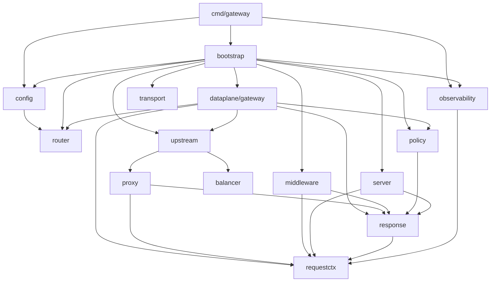

# Gateway 项目架构与 AI 开发导航

本文描述仓库**当前实现**，供 AI 定位代码、分析影响范围和开发时使用。长期目标见 [架构设计](../docs/02-architecture-design.md)，阶段计划不等同于现有能力。本次基线与验证记录见 [审查报告](../docs/10-current-architecture-review.md)。代码、`go.mod`、配置样例与实际验证优先于历史文档。

## 1. 项目定位与运行边界

- 单仓库、单 Go Module：`github.com/helantianshen/gateway`，无前端、数据库或迁移脚本。
- 正式二进制只有 `cmd/gateway`；`cmd/mock-service` 是本地演示服务。
- 当前为 Phase 5 静态数据面。启动读取一次 YAML；配置变化需要重启。
- 一个 gateway 进程拥有 public/admin 两个独立 HTTP Server，默认 `:8080` / `:9090`。admin 是运维端口，不是 Gin 控制面。
- 运行时外部依赖为配置文件、upstream HTTP/HTTPS 服务和日志输出；Prometheus 抓取端是可选外部消费者，仓库没有自带 Prometheus Server。
- 不存在 Gin、etcd、Redis、ConfigSnapshot、Watch、LKG、JWT、实际限流、主动健康检查、SWRR、应用级重试、OTel SDK、Dockerfile 或 Compose 实现。
- `go.mod` 最低版本为 `1.26.5`，CI 固定 `1.26.5`；没有 `toolchain` 指令。每次任务应独立核实本机版本，不把历史测试环境当作当前环境。

## 2. 阅读入口与目录职责

| 路径 | 关键符号 | 职责与边界 |
|---|---|---|
| `cmd/gateway/main.go` | `run` | Load → New → signal context → Run → 退出码；不放代理业务 |
| `cmd/mock-service/main.go` | `newMockHandler` | hello、echo、slow、stream 演示与 `X-Mock-Instance` |
| `internal/bootstrap/application.go` | `Application`, `newWithRuntime`, `Run`, `shutdown` | 唯一装配根，管理监听器、共享 Transport、logger 和服务生命周期 |
| `internal/config/` | `ConfigSpec`, `LoadConfig`, `Validate`, `Compile`, `Config` | YAML/env 输入、校验、强类型 URL/duration；不持有 endpoint 运行状态 |
| `internal/router/` | `Compile`, `ParsePath`, `Router.Match` | 不可变路由树、Host/Method/Path 语义及冲突；只返回逻辑 upstream ID |
| `internal/dataplane/gateway/` | `GatewayHandler`, `forward` | 路由、策略与 endpoint 的编排，写请求上下文 |
| `internal/dataplane/policy/` | `Middleware`, `CompiledChain` | 启动时编译 route 策略链；当前每条链为空 |
| `internal/dataplane/upstream/` | `CompiledUpstream`, `CompiledEndpoint`, `EndpointState` | endpoint 池、健康状态、代理实例和活跃请求计数 |
| `internal/dataplane/balancer/` | `RoundRobin.Select` | 只选择可用索引，使用 atomic CAS，不理解 HTTP 或配置 |
| `internal/dataplane/proxy/` | `Proxy`, `New`, `errorHandler` | 固定目标 ReverseProxy、Rewrite、timeout、错误分类 |
| `internal/dataplane/transport/` | `New`, `CloseIdleConnections` | 应用级共享连接池及固定网络参数 |
| `internal/dataplane/server/` | `NewPublicServer`, `NewAdminHandler` | Server 参数和三个运维端点；不创建监听器 |
| `internal/dataplane/middleware/` | `NewPublicHandler`, `Observe`, `Recovery`, `Guard` | 全局链、日志/指标钩子、请求大小限制及流式包装 |
| `internal/dataplane/requestctx/` | `RequestContext`, `Snapshot` | 单请求元数据、Request ID、traceparent v00 提取 |
| `internal/dataplane/response/` | `WriteError` | 统一 JSON 错误与上下文 ErrorKind |
| `internal/observability/` | `Metrics`, `NewProductionLogger` | 私有 Registry、endpoint Collector、zap；不做路由选择 |
| `configs/gateway.yaml` | `api_version: v1` | 可运行配置：一个逻辑 upstream、三个 endpoint、八条 route |
| `benchmarks/results/` | router / balancer / observability | 历史测量原始记录，不是自动执行的性能门禁 |
| `docs/01–03` | 选型 / 目标架构 / 路线 | 同时涉及未来阶段，先看状态说明 |
| `docs/04–09` | 阶段实施和历史回溯 | 历史接口、版本和验收证据；不作为现有 schema 使用 |

推荐阅读顺序：本文件 → `config/spec.go` → `cmd/gateway/main.go` → `bootstrap/application.go` → `middleware/middleware.go` → `gateway/handler.go` → `router/` → `upstream/` → `proxy/` → 对应测试。

## 3. 实际依赖关系

下面的箭头表示本项目包的 import 方向；同名节点均位于 `internal/`，`dataplane/` 前缀为简洁省略。



`middleware.RequestObserver` 由 `observability.Metrics` 隐式实现，bootstrap 注入，middleware 无需导入 observability。`observability.EndpointState` 由 upstream 的状态对象实现，Collector 不依赖整个 upstream 包。Router、balancer、transport 和 requestctx 均不依赖第三方库。mock-service 与 gateway 包图独立。

### 已落地第三方依赖

| 直接依赖 | go.mod 版本 | 使用位置 |
|---|---|---|
| `gopkg.in/yaml.v3` | v3.0.1 | config：两遍 YAML 解码、KnownFields 和 AST 位置 |
| `go.uber.org/zap` | v1.28.0 | observability、middleware、bootstrap、入口日志 |
| `github.com/prometheus/client_golang` | v1.23.2 | observability：Registry、Counter/Histogram/Gauge、promhttp |
| `github.com/felixge/httpsnoop` | v1.1.0 | middleware：保留可选接口的 ResponseWriter 包装 |

间接依赖由 Prometheus 的模型、编码、指标实现及 zap 支持组件等引入；`x/sys` 等也可能跨依赖链共享。精确版本与来源使用 `go list -m all`、`go mod graph` 和 `go mod why -m <module>` 核实，不把未来技术选型清单一次性安装到当前项目。固定工具 `staticcheck v0.7.0`、`govulncheck v1.6.0` 由 Makefile 的 `go run ...@版本` 执行，不是 gateway 运行时 import。

## 4. 配置管线与启动装配

```text
config.Load
  ├─ LoadBootstrapConfig：环境变量、空值/旧变量检测
  ├─ LoadConfig：读文件 → YAML AST → 单文档检查 → KnownFields 解码 → weight 默认值
  └─ Compile
      ├─ Validate：必填/唯一性/引用/URL/duration/range
      │   └─ router.Compile：检查路由语法与冲突，结果丢弃
      └─ 解析 URL/duration → Config.Upstreams + Config.Spec
bootstrap.New
  → production logger
  → router.Compile（再次编译，保留结果）
  → 根据 route 推导每个 upstream 的 ProxyMode
  → 私有 Metrics + 唯一 Transport
  → 编译所有 upstream/endpoint/state，按需创建 Proxy
  → 绑定 endpoint Collector
  → 编译空 route policy chain + GatewayHandler
  → public/admin middleware 和 handler
  → public listener → admin listener → 两个 Server
Application.Run
  → 两个 Serve goroutine
  → Context 取消或任一 Serve 退出
  → 并发 Shutdown → 必要时强制 Close
  → 收齐 Serve 结果并合并错误
```

正式路径在监听前完成配置校验。admin bind 失败会关闭已创建的 public listener；装配错误会关闭共享 Transport 的 idle connections。`New` 返回时已经绑定端口，调用方必须继续负责 Run/退出生命周期，不能把 New 当作纯配置构造器。

`Config.Spec` 保留输入指针；强类型 endpoint target 是新建值。Application 又保留 `*Config`，停机时读取其中 ShutdownTimeout。它们不是未来的不可变 ConfigSnapshot：装配完成后调用方不得并发修改。Router 的 freeze 会深拷贝自身树、route 和参数名。

### 输入契约

| 输入 | 当前行为 |
|---|---|
| `GATEWAY_CONFIG_FILE` | 默认 `configs/gateway.yaml`，相对启动工作目录 |
| `GATEWAY_PUBLIC_ADDR` / `GATEWAY_ADMIN_ADDR` | 默认 `:8080` / `:9090`，不是仅 loopback |
| `GATEWAY_SHUTDOWN_TIMEOUT` | 默认 10s，必须为正 duration |
| 旧 `GATEWAY_UPSTREAM_URL` / `GATEWAY_REQUEST_TIMEOUT` | 只要存在，即使空串也报迁移错误 |
| YAML 顶层 | `api_version`, `upstreams`, `routes`, `policies`；拒绝未知字段、空/null/多文档 |
| upstream/endpoint | upstream ID 全局唯一；endpoint ID 在同 upstream 内唯一；至少一个 endpoint |
| endpoint URL | 要求 http/https 绝对地址、非空 host、无 userinfo；不是网络可达性检查 |
| `weight` | 普通映射省略时默认 100；要求正数，普通 RR 不读取；merge/alias 边界见审查报告 |
| `request_timeout` | 正 duration，进入 Proxy 后创建 deadline；不是已验证覆盖所有客户端 I/O 的硬截止 |
| `rate` / `burst` | 仅解析、检查非负；非零也不会启动限流 |

YAML 解析错误提供文件/行/列；语义错误聚合文件和字段路径。路由编译遇到首个错误即返回，因此“聚合”并不意味着会列出全部路由错误。

## 5. 请求执行与路由语义

```text
public http.Server
  → InitializeRequestContext(version=1)
  → RequestID → TraceContext
  → Observe（日志/指标在 defer 收尾）
  → Recovery → Guard
  → GatewayHandler.ServeHTTP
      → ParsePath → Router.Match
      → MatchResult 写 context，RouteID/PathTemplate/UpstreamID 写元数据
      → routePolicies[RouteID].ServeHTTP
      → forward → upstreams[UpstreamID].Select
      → endpoint/attempt 元数据 → CompiledEndpoint.ServeHTTP
      → active +1 / defer -1
      → 固定 Proxy → 共享 Transport → upstream
```

- `ParsePath` 读取 `EscapedPath`，拒绝编码斜杠/反斜杠、dot segment 和非法 UTF-8；按 segment 解码，不自动 Clean、合并重复斜杠或重定向。
- Host 去端口、单个尾点、ASCII 转小写；非法请求 Host 归一化为空，仍可能命中 any-host route。通配只匹配一层合法 DNS label。
- 匹配按 Host exact > wildcard > any，然后 Method，再逐段 static > param > catch-all，最后同结构 priority；不是把所有维度相加打分。
- 请求 Method 在 Match 中转大写；HEAD 依次找 HEAD → GET → any，转发仍保留原始 Method。`MatchMethod` helper 自身区分大小写，不能替代完整 matcher。
- 请求 `/a/` 与 `/a` 区分，但配置 parser 拒绝非根路径中的空段，所以当前不能声明静态 `/a/`；可被 catch-all 接收。
- `:param` 匹配非空单段；末尾 `*catchAll` 可匹配空余段。参数名不参与树结构，结果从命中叶子绑定。
- 冲突检测使用 Host/Method 分组内的路径结构+priority key；相同结构、同 priority 的路由在启动时拒绝。
- 运行时 static 子边二分检索；Host 组仍线性遍历。builder 的兄弟查找也是线性扫描，不应声称整个编译器为 O(n)。
- Proxy `SetURL` 会拼接 target base path/query；没有 route 级 strip/rewrite 功能。标准库 Rewrite 的 query 清理语义仍适用，不承诺任意畸形 query 字节原样保留。

## 6. 所有权、并发与网络参数

| 对象 | 所有者 / 生命周期 | 可变性 |
|---|---|---|
| Router 冻结树 | Application | 启动后只读 |
| route chain、endpoint 拓扑、固定 Proxy | Application 内各 handler/pool | 启动后只读；禁止请求内重新创建 |
| RoundRobin cursor | 每个 CompiledUpstream | atomic.Uint64 + CAS |
| EndpointState | 每个 endpoint | healthy/active 原子读写；初始全健康 |
| http.Transport | Application | 跨 endpoint/route 共享；运行时不改字段；停机清理 idle |
| RequestContext | 单次请求 | 普通字段，无锁；异步读取 body、回调或新增 goroutine 时须重新验证并发安全 |
| Metrics Registry | 每个 Application | 库内并发安全；endpoint sources 使用 RWMutex |
| zap logger | production Application；测试可注入 | Application 刷新自己拥有的 logger，入口另在退出前 Sync |

健康状态没有后台更新器；上游连接失败不会自动 SetHealthy(false)。应用每次请求只选一次 endpoint；“无应用级重试”不等于禁止标准 Transport 自身在可重放请求上的内部行为。active 计数覆盖整个 endpoint Proxy 调用，包括等待连接与流式传输，不等于 TCP 连接数。

| 参数 | 当前值 |
|---|---|
| public/admin ReadHeaderTimeout / IdleTimeout | 10s / 120s |
| public/admin ReadTimeout / WriteTimeout | 0 / 0 |
| MaxHeaderBytes | 1 MiB，由 net/http 解析层限制 |
| Guard Header 名数量 / Body | 100 / 64 MiB；按不同 Header 名计数，不是原始行数 |
| Transport Dial / TLS handshake / ResponseHeader timeout | 10s / 10s / 30s |
| Transport idle timeout / KeepAlive | 90s / 30s |
| MaxIdleConns / MaxIdleConnsPerHost / MaxConnsPerHost | 100 / 20 / 100；后者包含拨号中、活跃与空闲连接 |
| upstream TLS / HTTP2 | 最低 TLS 1.2、验证证书；HTTPS 尝试 HTTP/2 |

Transport 未设置 ProxyFromEnvironment，gateway 出口不使用 HTTP_PROXY/HTTPS_PROXY。入口只调用 Serve，不提供 TLS 终止。Guard 是流式自制 limiter，不是直接调用 MaxBytesReader；返回相同类型的超限错误。已转发的请求体片段无法撤回，上游提前响应时也不能保证所有未知长度超限都转换为 413。

停机使用新的 Background timeout context，让已有请求先完成；超时再 Close 活跃 HTTP 连接。Serve 循环退出不等于对所有业务 goroutine 或 hijacked 连接完成了等待；WebSocket 全生命周期没有被当前验收覆盖。

## 7. 错误与可观测边界

| 阶段 | 结果 |
|---|---|
| Guard | 431 Header 名数量超限；413 已知长度超限或读取时触发限制 |
| ParsePath / Match | 400 非法路径 / 404 未命中 |
| endpoint 选择 | 全部状态 unhealthy 返回 503；缺失 runtime target/Proxy 模式防御性返回 502 |
| Proxy | 超时 504；连接/协议错误 502；客户端取消只标内部 499 |
| Recovery | 最终响应前 panic → 500；已开始响应则中断；ErrAbortHandler 原样重新抛出 |
| 上游业务错误 | 上游 4xx/5xx 透传，ErrorKind 为空，与网关自产错误区分 |

JSON 统一结构是 `{code,message,request_id}`。这一契约只涵盖到达应用中间件/handler 的错误；net/http 在 Handler 前拒绝的畸形请求和超大 Header 不经过 requestctx，也不保证 JSON、Request ID 或 public Metrics。

Observe 读取同一 RequestContext，不重做路由匹配。zap 完成日志使用受控字段，不主动记录原始 path、query、凭据或 body。**ReverseProxy 默认错误日志尚有原文泄露路径，1xx 的最终状态及 Request ID 也存在缺陷**，见审查报告，不应把设计契约当作无例外保证。

Metrics 的十组指标由 `metrics.go` 定义，版本恒为 1。Method 非标准值聚合 `_OTHER`，空值 `_none`，未命中 `_unmatched`；路由数超过 1000 时 per-route 维度聚合 `_other`。1000 是路由数量阈值，不是所有 Prometheus series 的总上限。endpoint Collector 在 scrape 时直接读原子状态。未注册默认 Go/process collectors。

admin 只有 GET/HEAD `/livez`、`/readyz`、`/metrics`，其他 method 返回 405，未知路径返回 JSON 404；ServeMux 的规范化重定向仍适用。admin 保留日志与 Recovery，不执行 public Guard，也不计入 public 请求指标。readyz 恒为 200 表示本地已启动，不检查 upstream、没有独立 draining 状态；管理口无认证，应由监听地址与外部网络策略控制访问。

## 8. 修改定位与验证要求

| 修改类型 | 先读代码 | 必须考虑的验证 |
|---|---|---|
| YAML 字段/默认值 | config 的 spec/loader/validate/bootstrap | 未知字段、显式零值、alias/merge、跨字段引用、启动前失败、样例同步 |
| 路由语义 | router 的 path/host/method/compile/tree/match | 表驱动、独立 reference、差分、实际编码请求；HEAD/优先级/参数/插入顺序 |
| 代理或 middleware | proxy、middleware、requestctx、response | 真实 HTTP、1xx+最终响应、Connection token、Trailer、慢上传、SSE、取消、超限、panic |
| endpoint/balancer | upstream、balancer、gateway、bootstrap | 健康过滤、并发分布、活跃数清理、Host 两种模式、连接复用 |
| 日志/指标 | observability、observe、recovery | public/admin 隔离、隐式状态、中断、字段基数、标准库旁路日志 |
| 生命周期 | cmd/gateway、bootstrap、server、transport | bind 失败清理、取消、Shutdown 超时强关、两个 Serve 错误收齐 |
| 后续动态配置 | config + bootstrap 的全装配链 | 先按 Phase 6/7 设计新增独立快照生命周期，不原地改现有 Router/map |

常用命令在仓库根执行：

```bash
go list -f '{{.ImportPath}}: {{join .Imports " "}}' ./...
go list -m all
go mod verify
make verify  # whitespace、gofmt、vet、test、race、build
make audit   # 固定版本 staticcheck + govulncheck，可能下载工具并联网
```

`make fmt` 会修改文件；只检查用 `make fmt-check`。`make bench*` 和 `make fuzz*` 会覆盖 `benchmarks/results/` 中的历史证据，除非任务要求更新基线，否则把专项结果写到临时目录。CI 目前没有执行 fuzz、benchmark 或多进程 E2E。

## 9. 文档维护规则

架构/依赖/生命周期发生变化时更新本文件；用户可见配置和启动方式更新 README、配置样例、CONTRIBUTING；目标范围改变再更新 docs/01–03。历史报告保留原日期、版本与证据，加状态说明和后续链接，不把旧 PASS 改写成本次 PASS。

开放缺陷及本次证据集中在 [当前审查报告](../docs/10-current-architecture-review.md) 与 [专项复现记录](tasks/2026-09-27-review-evidence.md)。任务进度放在 `tasks/`，不把临时命令、个人机器绝对路径或一次性测量堆进长期架构正文。
